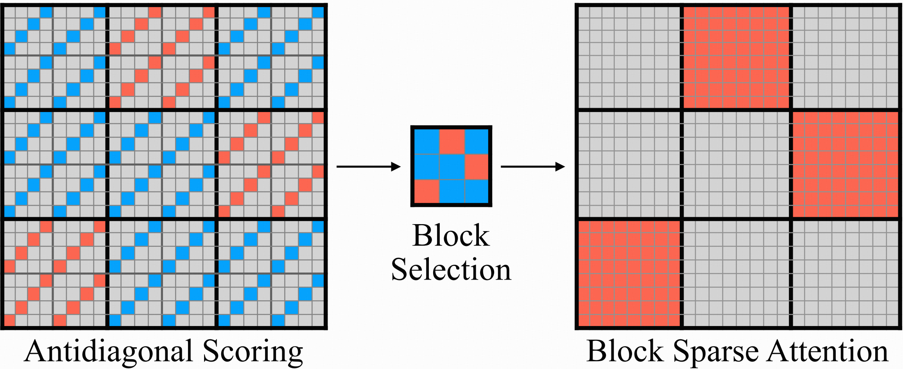

# Challenge

This repository contains two take-home challenges for general-purpose engineers.

The goal is not to test prior domain specialization. The goal is to test whether someone can enter an unfamiliar problem space, ask the right questions, search effectively, find the critical information, use AI well, and turn that into a pragmatic solution.

## What We Evaluate

- Learning: how quickly the candidate enters an unfamiliar domain and becomes effective.
- Search: how well they research, ask the right questions, and separate signal from noise.
- Problem Solving: how they turn incomplete information into a practical plan or working solution.
- Judgment: whether they find the highest-leverage changes instead of giving generic answers.
- Range: whether they can handle both research-heavy architecture work and hands-on reverse engineering.
- Communication: how clearly they explain reasoning, tradeoffs, and validation.
- AI Usage: how effectively they use AI as a tool for exploration, learning, and execution.

## Challenges

### 1. [FLUX.2 Inference Optimization Challenge](./task-ai.md) (4 hours)

Study an unfamiliar ML inference system and propose architecture-aware latency optimizations, testing how quickly the candidate can learn, research, and find the highest-leverage changes.

### 2. [Hancom Docs Automation SDK Challenge](./task-web.md) (4 hours)

Reverse-engineer a canvas-based editor with no public API and build a CDP-based SDK, testing how well the candidate explores opaque systems, finds the key insight, and turns it into working software.
