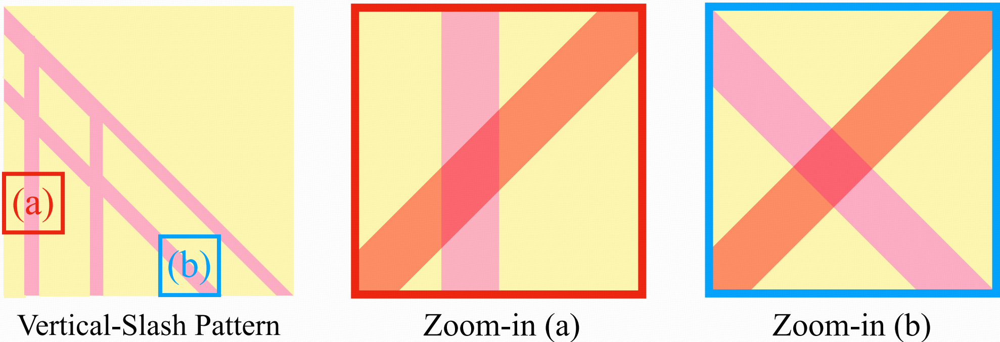

# FLUX.2 Inference Optimization Challenge



## Goal

Make this pipeline 4x faster.

Answers like "use FP8" or "use flash attention" alone are not what we're looking for. We want to see deeper, architecture-aware optimizations specific to this model and use case.

## Context

You are joining a team that runs a **virtual try-on** product. The core model is **FLUX.2 Klein [4B]** — a rectified flow transformer that takes a reference image and generates a try-on output.

### The Product Scenario

- A user uploads their **avatar photo** once per session (high resolution, e.g. 1024x1024 or larger)
- They click through dozens of **clothing items** to try on — tops, bottoms, shoes, accessories, etc. (various aspect ratios and resolutions)
- Each click generates a new try-on output image (1024x1024)
- The avatar stays constant throughout the session; the clothing changes every click
- Currently the full pipeline runs from scratch on every click

### Input Design

FLUX.2 Klein takes **one or more reference images** as input (see the code for how they're handled). The model doesn't know anything about "avatar" vs "clothing" — it just sees reference image tokens.

**How would you preprocess and feed these inputs to the model?** This is part of the challenge — think about what format gives you the most optimization opportunities given that the same person will try on many different items in a single session.

### Available Hardware

| GPU | VRAM | Compute Capability |
|---|---|---|
| **NVIDIA H100 SXM** | 80 GB | SM 90 (Hopper) |
| **NVIDIA RTX 4090** | 24 GB | SM 89 (Ada Lovelace) |

### Current Pipeline (per click)

```
1. Preprocess    →  Prepare reference image(s) from avatar + clothing
2. VAE encode    →  Reference image(s) → latent tokens
3. Denoise ×4    →  4 transformer forward passes
4. VAE decode    →  Latent → output image (1024x1024)
```

Current production latency on H100: ~1.4s end-to-end.

### Performance Baseline

Vanilla PyTorch + Diffusers: ~4-5s. Our current production: ~1.4s on H100. Target: sub-1s per click.

## References

1. **BFL FLUX.2 reference code**: https://github.com/black-forest-labs/flux2
   - Key files: `src/flux2/model.py`, `src/flux2/sampling.py`, `src/flux2/autoencoder.py`
   - Klein is a variant — same architecture, different config
2. **Model config** (Klein [4B]):

   | Parameter | Value |
   |---|---|
   | Hidden dim | 3072 (24 heads × 128 head_dim) |
   | Double stream blocks | 5 |
   | Single stream blocks | 20 |
   | In channels | 128 (32 z_channels × 2×2 patch) |
   | Denoising steps | 4 (distilled) |
   | Guidance scale | 1.0 (no CFG) |

## Deliverables

Write a document covering the following. Quality of reasoning matters more than volume.

### Part 1: Architecture Analysis and Input Design

Read the FLUX.2 reference code. Explain:

1. How the VAE encoder works — what layers does it have, and what are the implications for caching
2. How reference, noise, and text tokens are assembled and what the attention visibility rules are
3. What properties of reference tokens matter for optimization, including whether any work can be reused in the transformer across clicks
4. **How would you feed the avatar + clothing inputs to the model?** Propose a preprocessing strategy and explain why it's better for optimization than alternatives

### Part 2: Optimization Strategies

The core of this challenge. Based on your architecture analysis and whatever you can find through research (papers, repos, blog posts, NVIDIA docs), propose strategies to reduce per-click latency.

For each strategy:
- What is cached, skipped, or changed
- What code changes are needed
- Estimated impact and why
- Quality risks (if any)

We are looking for strategies across multiple levels of the stack, not a single idea.
Good answers will discuss both VAE-side reuse and transformer-side reuse.

### Part 3: Experiment Plan

How would you benchmark and validate your proposed strategies? Think about:
- How to organize tests systematically
- What metrics matter
- How to handle strategies that change model behavior (quality validation)
- What order to test things in and why

## Hints

1. Read the reference code carefully — there's more than one denoising path.
2. Think about what the VAE encoder's internal architecture means for caching parts of an input image independently.
3. Also think about whether the transformer denoising path creates reuse opportunities across repeated clicks.

## Notes

- This is NOT a coding test — no running code expected
- You are expected to read the source code and search the internet extensively
- We use NVIDIA's inference stack in production — find the best available GPU kernels and inference frameworks on GitHub for this model family
- There is no single right answer — we want to see how you explore the problem space

## Related References

- [black-forest-labs/flux](https://github.com/black-forest-labs/flux2) — official reference implementation for the model family; start here for architecture and sampling code.
- [NVIDIA on GitHub](http://github.com/NVIDIA) — useful starting point for finding NVIDIA-maintained inference, kernel, and optimization projects related to this challenge.
- [Learning-to-Cache: Accelerating Diffusion Transformer via Layer Caching](https://arxiv.org/abs/2406.01733) — a representative paper on DiT caching that should help you think beyond generic precision or kernel suggestions.

---

Good luck. We value the journey (your exploration process) as much as the destination (report).
